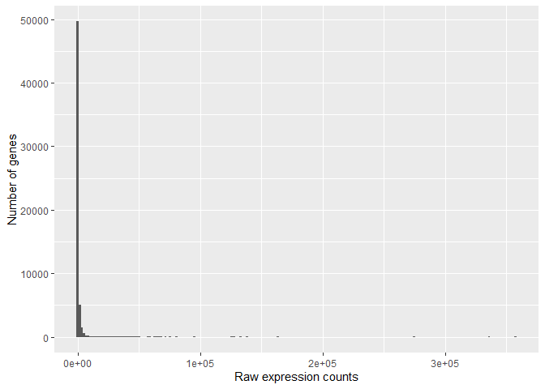

RNA-seq differential gene expression analysis of MOV10 knock-down or overexpression in HEK293F cells
================

``` r
library(DESeq2)
library(tidyverse)
library(RColorBrewer)
library(pheatmap)
library(DEGreport)
library(tximport)
library(ggplot2)
library(ggrepel)
library(DOSE)
library(pathview)
library(clusterProfiler)
library(gridExtra)
```

## Read Salmon result

``` r
## List all directories containing Salmon output data  
samples <- list.files(path = "D:/RNASeq/Mov10/data/salmon", full.names = T, pattern="salmon")

## Obtain a vector of all filenames including the path
files <- file.path(samples, "quant.sf")

## Since all quant files have the same name it is useful to have names for each element
names(files) <- str_replace(samples, "D:/RNASeq/Mov10/data/salmon/", "") %>% 
                str_replace(".salmon", "")
```

## Read annotation file

``` r
tx2gene <- readRDS("D:/RNASeq/Mov10/data/tx2gene_grch38_ens101.rds")
```

# Import data from multiple samples, convert normalized TPM to non-normalized count estimates for performing DESeq2 analysis using tximport package

``` r
txi <- tximport(files, type="salmon", tx2gene=tx2gene[,c("tx_id", "gene_id")], countsFromAbundance="lengthScaledTPM")
```

    ## reading in files with read_tsv

    ## 1 2 3 4 5 6 7 8 
    ## transcripts missing from tx2gene: 1342
    ## summarizing abundance
    ## summarizing counts
    ## summarizing length

``` r
data <- txi$counts %>% 
  round() %>% 
  data.frame()
```

``` r
#metadata
meta=data.frame(sampletype=c(rep("control",3),rep("MOV10_knockdown", 2), rep("MOV10_overexpression", 3)),row.names = colnames(txi$counts))
```

``` r
ggplot(data)+
  geom_histogram(aes(x=Mov10_oe_1), stat = "bin",bins = 200)+
  xlab("Raw expression counts") +
  ylab("Number of genes")
```



### Gene expression variance is correlated with expression level

``` r
mean_counts <- apply(data[,6:8], 1, mean)        #The second argument '1' of 'apply' function indicates the function being applied to rows. Use '2' if applied to columns 
variance_counts <- apply(data[,6:8], 1, var)
df <- data.frame(mean_counts, variance_counts)

ggplot(df) +
        geom_point(aes(x=mean_counts, y=variance_counts)) + 
        scale_y_log10(limits = c(1,1e9)) +
        scale_x_log10(limits = c(1,1e9)) +
        geom_abline(intercept = 0, slope = 1, color="red")
```

    ## Warning: Transformation introduced infinite values in continuous y-axis

    ## Warning: Transformation introduced infinite values in continuous x-axis

    ## Warning: Removed 6691 rows containing missing values (geom_point).


``` r
### Check that sample names match in both files
all(colnames(txi$counts) %in% rownames(meta))
```

    ## [1] TRUE

``` r
all(colnames(txi$counts) == rownames(meta))
```

    ## [1] TRUE

``` r
#a=data[,row.names(meta)] reorder the data frame if necessary
```

## Count Normalization

#### Step 1: Estimate size factors

#### Step 2: Estimate gene-wise dispersion

#### Step 3: Fit curve to gene-wise dispersion estimates

#### Step 4: Shrink gene-wise dispersion estimates toward the values predicted by the curve

##### For the significant test, we need to know gene expression variance within replicates. However, the small sample size makes the variance estimation difficult. DeSeq adjust dispersion (dispersion accounts for a gene's variance and mean expression level) estimates using information from all genes with the similar expression level (maximum a posteriori probability (MAP) estimate).

``` r
#design formula assigns sampletype as the major source of variation in the data
dds <- DESeqDataSetFromTximport(txi, colData = meta, design = ~ sampletype)
```

    ## Warning in DESeqDataSet(se, design = design, ignoreRank): some variables in
    ## design formula are characters, converting to factors

    ## using just counts from tximport

``` r
#View(counts(dds))
```

``` r
dds <- DESeq(dds)
```

    ## estimating size factors

    ## estimating dispersions

    ## gene-wise dispersion estimates

    ## mean-dispersion relationship

    ## final dispersion estimates

    ## fitting model and testing

``` r
sizeFactors(dds)
```

    ## Irrel_kd_1 Irrel_kd_2 Irrel_kd_3 Mov10_kd_2 Mov10_kd_3 Mov10_oe_1 Mov10_oe_2 
    ##  1.1151062  0.9603786  0.7496376  1.5635791  0.9361478  1.2260968  1.1404036 
    ## Mov10_oe_3 
    ##  0.6538415

``` r
normalized_counts <- counts(dds, normalized=TRUE)
```

``` r
write.table(normalized_counts, file="mov10_normalized_counts.txt", sep="\t", quote=F, col.names=NA)
```

## Data QC: check whether samples of the same condition are clustered together

``` r
#normalized counts using regularized log transform (rlog) for PCA
rld <- rlog(dds, blind=TRUE)
### Plot PCA 
plotPCA(rld, intgroup="sampletype")
```


``` r
 # Input is a matrix of log transformed values
 rld_mat <- assay(rld)
 pca <- prcomp(t(rld_mat))

 # Create data frame with metadata and PC3 and PC4 values for input to ggplot
 df <- cbind(meta, pca$x)
 ggplot(df) + geom_point(aes(x=PC3, y=PC4, color = sampletype))
```


### Hierarchical Clustering

``` r
### Extract the rlog matrix from the object
rld_mat <- assay(rld) 
rld_cor <- cor(rld_mat)    ## cor() is a base R function

head(rld_cor)
```

    ##            Irrel_kd_1 Irrel_kd_2 Irrel_kd_3 Mov10_kd_2 Mov10_kd_3 Mov10_oe_1
    ## Irrel_kd_1  1.0000000  0.9997731  0.9997532  0.9996033  0.9996341  0.9995393
    ## Irrel_kd_2  0.9997731  1.0000000  0.9997561  0.9995723  0.9996159  0.9995467
    ## Irrel_kd_3  0.9997532  0.9997561  1.0000000  0.9995481  0.9996021  0.9995568
    ## Mov10_kd_2  0.9996033  0.9995723  0.9995481  1.0000000  0.9997928  0.9993912
    ## Mov10_kd_3  0.9996341  0.9996159  0.9996021  0.9997928  1.0000000  0.9994783
    ## Mov10_oe_1  0.9995393  0.9995467  0.9995568  0.9993912  0.9994783  1.0000000
    ##            Mov10_oe_2 Mov10_oe_3
    ## Irrel_kd_1  0.9995327  0.9994123
    ## Irrel_kd_2  0.9995416  0.9994298
    ## Irrel_kd_3  0.9995617  0.9994248
    ## Mov10_kd_2  0.9993633  0.9992391
    ## Mov10_kd_3  0.9994476  0.9993502
    ## Mov10_oe_1  0.9997802  0.9996931

``` r
pheatmap(rld_cor, annotation = meta)
```


#### Data should be arround the fitted curve, dispersion should decrease with increasing normalized counts

``` r
## Plot dispersion estimates
plotDispEsts(dds)
```


### Find the differentially expressed genes between mov10 overexpression and control

``` r
resultsNames(dds)
```

    ## [1] "Intercept"                                 
    ## [2] "sampletype_MOV10_knockdown_vs_control"     
    ## [3] "sampletype_MOV10_overexpression_vs_control"

#### Shrink the fold change to zero if the gene count is low or the gene has a high dispersion. This dones't change the number of significant genes.

``` r
contrast_oe <- c("sampletype", "MOV10_overexpression", "control")

res_tableOE_unshrunken <- results(dds, contrast=contrast_oe, alpha = 0.05)

# Apply fold change shrinkage
res_tableOE <- lfcShrink(dds, "sampletype_MOV10_overexpression_vs_control", res=res_tableOE_unshrunken,type = "apeglm")
```

    ## using 'apeglm' for LFC shrinkage. If used in published research, please cite:
    ##     Zhu, A., Ibrahim, J.G., Love, M.I. (2018) Heavy-tailed prior distributions for
    ##     sequence count data: removing the noise and preserving large differences.
    ##     Bioinformatics. https://doi.org/10.1093/bioinformatics/bty895

``` r
class(res_tableOE_unshrunken)
```

    ## [1] "DESeqResults"
    ## attr(,"package")
    ## [1] "DESeq2"

``` r
mcols(res_tableOE_unshrunken, use.names=T)
```

    ## DataFrame with 6 rows and 2 columns
    ##                        type            description
    ##                 <character>            <character>
    ## baseMean       intermediate mean of normalized c..
    ## log2FoldChange      results log2 fold change (ML..
    ## lfcSE               results standard error: samp..
    ## stat                results Wald statistic: samp..
    ## pvalue              results Wald test p-value: s..
    ## padj                results   BH adjusted p-values

``` r
## Summarize results
summary(res_tableOE, alpha = 0.05)
```

    ## 
    ## out of 38725 with nonzero total read count
    ## adjusted p-value < 0.05
    ## LFC > 0 (up)       : 2001, 5.2%
    ## LFC < 0 (down)     : 2769, 7.2%
    ## outliers [1]       : 28, 0.072%
    ## low counts [2]     : 21214, 55%
    ## (mean count < 16)
    ## [1] see 'cooksCutoff' argument of ?results
    ## [2] see 'independentFiltering' argument of ?results

#### MA plot, should see the significant genes (colored) along the whole x-axis.

``` r
plotMA(res_tableOE_unshrunken, ylim=c(-2,2))
```


``` r
plotMA(res_tableOE, ylim=c(-2,2))
```


``` r
## Define contrasts, extract results table and shrink log2 fold changes
contrast_kd <-  c("sampletype", "MOV10_knockdown", "control")

#alpha is the value of the indepdendent filtering, filter out part of genes before the significant test
#use the Wald test by default
res_tableKD <- results(dds, contrast=contrast_kd, alpha = 0.05)

res_tableKD <- lfcShrink(dds, "sampletype_MOV10_knockdown_vs_control", res=res_tableKD)
```

    ## using 'apeglm' for LFC shrinkage. If used in published research, please cite:
    ##     Zhu, A., Ibrahim, J.G., Love, M.I. (2018) Heavy-tailed prior distributions for
    ##     sequence count data: removing the noise and preserving large differences.
    ##     Bioinformatics. https://doi.org/10.1093/bioinformatics/bty895

``` r
padj.cutoff=0.05
res_tableOE_tb <- res_tableOE %>%
  data.frame() %>%
  rownames_to_column(var="gene") %>% 
  as_tibble()
sigOE <- res_tableOE_tb %>%
        filter(padj < padj.cutoff)
sigOE
```

    ## # A tibble: 4,770 x 6
    ##    gene            baseMean log2FoldChange  lfcSE       pvalue        padj
    ##    <chr>              <dbl>          <dbl>  <dbl>        <dbl>       <dbl>
    ##  1 ENSG00000000003    3526.         -0.419 0.0781 0.0000000165 0.000000454
    ##  2 ENSG00000000419    1478.          0.345 0.115  0.000745     0.00469    
    ##  3 ENSG00000000460    1160.         -0.246 0.0810 0.00102      0.00606    
    ##  4 ENSG00000001084    1268.         -0.240 0.111  0.0126       0.0469     
    ##  5 ENSG00000001167    2501.         -0.285 0.0650 0.00000357   0.0000510  
    ##  6 ENSG00000002016     921.         -0.271 0.116  0.00663      0.0282     
    ##  7 ENSG00000002330     715.         -0.401 0.133  0.000450     0.00307    
    ##  8 ENSG00000002549    1542.         -0.259 0.0876 0.00124      0.00714    
    ##  9 ENSG00000002834    2669.         -0.226 0.0539 0.0000138    0.000162   
    ## 10 ENSG00000002919     886.         -0.388 0.0869 0.00000177   0.0000276  
    ## # ... with 4,760 more rows

``` r
res_tableKD_tb <- res_tableKD %>%
  data.frame() %>%
  rownames_to_column(var="gene") %>% 
  as_tibble()
  
sigKD <- res_tableKD_tb %>%
        filter(padj < padj.cutoff)
sigKD
```

    ## # A tibble: 2,772 x 6
    ##    gene            baseMean log2FoldChange  lfcSE   pvalue         padj
    ##    <chr>              <dbl>          <dbl>  <dbl>    <dbl>        <dbl>
    ##  1 ENSG00000000457     519.          0.375 0.114  1.61e- 4 0.00254     
    ##  2 ENSG00000002330     715.         -0.350 0.151  2.87e- 3 0.0234      
    ##  3 ENSG00000002549    1542.         -0.426 0.101  2.87e- 6 0.0000867   
    ##  4 ENSG00000002822     654.          0.484 0.266  4.99e- 3 0.0355      
    ##  5 ENSG00000003056    3433.          0.482 0.0793 1.38e-10 0.0000000135
    ##  6 ENSG00000003756    4582.          0.349 0.0726 3.09e- 7 0.0000128   
    ##  7 ENSG00000004399    1279.          0.465 0.141  1.06e- 4 0.00180     
    ##  8 ENSG00000004777     592.         -0.620 0.495  5.72e- 3 0.0394      
    ##  9 ENSG00000005073     601.         -0.282 0.0994 1.09e- 3 0.0114      
    ## 10 ENSG00000005100    2857.          0.230 0.0655 2.09e- 4 0.00312     
    ## # ... with 2,762 more rows

## Data visualization

``` r
mov10_meta = meta%>%rownames_to_column(var='samplename')%>%as_tibble()

normalized_counts = normalized_counts %>% 
  data.frame() %>% rownames_to_column(var='gene')

grch38annot = tx2gene%>%select(gene_id,symbol)%>%distinct()

normalized_counts <- merge(normalized_counts, grch38annot, by.x="gene", by.y="gene_id")

normalized_counts <- normalized_counts %>%
                     as_tibble()
  
normalized_counts 
```

    ## # A tibble: 57,529 x 10
    ##    gene  Irrel_kd_1 Irrel_kd_2 Irrel_kd_3 Mov10_kd_2 Mov10_kd_3 Mov10_oe_1
    ##    <chr>      <dbl>      <dbl>      <dbl>      <dbl>      <dbl>      <dbl>
    ##  1 ENSG~   3924.       3795.      3959.      3951.      3940.      2727.  
    ##  2 ENSG~     24.2        30.2       30.7       23.7       13.9       20.4 
    ##  3 ENSG~   1325.       1340.      1179.      1515.      1431.      1541.  
    ##  4 ENSG~    456.        422.       476.       597.       610.       528.  
    ##  5 ENSG~   1250.       1212.      1134.      1389.      1300.       966.  
    ##  6 ENSG~      0.897       1.04       0          1.28       0          0   
    ##  7 ENSG~     19.7        18.7        9.34      10.2        2.14       7.34
    ##  8 ENSG~   2923.       2705.      2641.      2942.      2971.      2396.  
    ##  9 ENSG~   1308.       1244.      1314.      1449.      1638.       922.  
    ## 10 ENSG~   2752.       2514.      2600.      2948.      2817.      2148.  
    ## # ... with 57,519 more rows, and 3 more variables: Mov10_oe_2 <dbl>,
    ## #   Mov10_oe_3 <dbl>, symbol <chr>

### Plot expression of a single gene

``` r
grch38annot[grch38annot$symbol == "MOV10", "gene_id"]
```

    ## [1] "ENSG00000155363"

``` r
# Save plotcounts to a data frame object
d <- plotCounts(dds, gene="ENSG00000155363", intgroup="sampletype", returnData=TRUE)


# Plot the MOV10 normalized counts, using the samplenames (rownames(d) as labels)
ggplot(d, aes(x = sampletype, y = count, color = sampletype)) + 
    geom_point(position=position_jitter(w = 0.1,h = 0)) +
    geom_text_repel(aes(label = rownames(d))) + 
    theme_bw() +
    ggtitle("MOV10") +
    theme(plot.title = element_text(hjust = 0.5))
```


### Heatmap

``` r
norm_OEsig <- normalized_counts[,c(1:4,7:9)] %>% 
              filter(gene %in% sigOE$gene)  

### Set a color palette
heat_colors <- brewer.pal(6, "YlOrRd")

### Run pheatmap using the metadata data frame for the annotation
pheatmap(norm_OEsig[2:7], 
    color = heat_colors, 
    cluster_rows = T, 
    show_rownames = F,
    annotation = meta, 
    border_color = NA, 
    fontsize = 10, 
    scale = "row", 
    fontsize_row = 10, 
    height = 20)
```


### Volcano plot

``` r
res_tableOE_tb <- res_tableOE_tb %>% 
                  mutate(threshold_OE = padj < 0.05 & abs(log2FoldChange) >= 0.58) %>% left_join(grch38annot, by=c("gene" = "gene_id")) %>% 
  mutate(genelabels = "")%>% arrange(padj)

#label the name of the top 10 siginicant genes
res_tableOE_tb$genelabels[1:10] <- as.character(res_tableOE_tb$symbol[1:10])
```

``` r
ggplot(res_tableOE_tb, aes(x = log2FoldChange, y = -log10(padj))) +
    geom_point(aes(colour = threshold_OE)) +
    geom_text_repel(aes(label = genelabels)) +
    ggtitle("Mov10 overexpression") +
    xlab("log2 fold change") + 
    ylab("-log10 adjusted p-value") +
    theme(legend.position = "none",
          plot.title = element_text(size = rel(1.5), hjust = 0.5),
          axis.title = element_text(size = rel(1.25))) 
```

    ## Warning: Removed 40046 rows containing missing values (geom_point).

    ## Warning: Removed 40046 rows containing missing values (geom_text_repel).


### Likelihood ratio test (LRT): evaluate expression change across more than two conditions

#### Build models with the factor (sample type in this example) and without the factor then calculate the ratio of their likelihoods.

``` r
# The full model was specified previously with the `design = ~ sampletype`:
# dds <- DESeqDataSetFromTximport(txi, colData = meta, ~ sampletype)

# ~1 means only consider the intercept for the reduced model
# Likelihood ratio test
dds_lrt <- DESeq(dds, test="LRT", reduced = ~ 1)
```

    ## using pre-existing size factors

    ## estimating dispersions

    ## found already estimated dispersions, replacing these

    ## gene-wise dispersion estimates

    ## mean-dispersion relationship

    ## final dispersion estimates

    ## fitting model and testing

``` r
res_LRT <- results(dds_lrt)
```

``` r
# Create a tibble for LRT results
res_LRT_tb <- res_LRT %>%
  data.frame() %>%
  rownames_to_column(var="gene") %>% 
  as_tibble()

# Subset to return genes with padj < 0.05
sigLRT_genes <- res_LRT_tb %>% 
  filter(padj < padj.cutoff)

# Get number of significant genes
nrow(sigLRT_genes)
```

    ## [1] 7248

``` r
# Compare to numbers we had from Wald test
nrow(sigOE)
```

    ## [1] 4770

``` r
nrow(sigKD)
```

    ## [1] 2772

#### Explore gene clusters showing a certain pattern among different samples

``` r
meta$sampletype=factor(meta$sampletype)

clustering_sig_genes <- sigLRT_genes %>%
  arrange(padj) %>%
  head(n=1000)


# Obtain rlog values for those significant genes
cluster_rlog <- rld_mat[clustering_sig_genes$gene, ]
# Use the `degPatterns` function from the 'DEGreport' package to show gene clusters across sample groups
clusters <- degPatterns(cluster_rlog, metadata = meta, time = "sampletype", col=NULL)
```

    ## Working with 1000 genes.

    ## Warning: `distinct_()` is deprecated as of dplyr 0.7.0.
    ## Please use `distinct()` instead.
    ## See vignette('programming') for more help
    ## This warning is displayed once every 8 hours.
    ## Call `lifecycle::last_warnings()` to see where this warning was generated.

    ## Working with 1000 genes after filtering: minc > 15

    ## Joining, by = "merge"
    ## Joining, by = "merge"


``` r
# What type of data structure is the `clusters` output?
class(clusters)
```

    ## [1] "list"

``` r
# Let's see what is stored in the `df` component
head(clusters$df)
```

    ##                           genes cluster
    ## ENSG00000155363 ENSG00000155363       1
    ## ENSG00000173110 ENSG00000173110       1
    ## ENSG00000189060 ENSG00000189060       1
    ## ENSG00000187621 ENSG00000187621       2
    ## ENSG00000265972 ENSG00000265972       1
    ## ENSG00000270882 ENSG00000270882       3

``` r
# Extract the Group 1 genes
cluster_groups <- clusters$df
group1 <- clusters$df %>%
          filter(cluster == 1)
```

## Functional analysis

### GO enrichment analysis using clusterProfiler

``` r
#org.Hs.eg.db: Genome wide annotation for Human
library(org.Hs.eg.db)
```

    ## Loading required package: AnnotationDbi

    ## 
    ## Attaching package: 'AnnotationDbi'

    ## The following object is masked from 'package:clusterProfiler':
    ## 
    ##     select

    ## The following object is masked from 'package:dplyr':
    ## 
    ##     select

``` r
## Create background dataset for hypergeometric testing using all genes tested for significance in the results                 
allOE_genes <- as.character(res_tableOE_tb$gene)

## Extract significant results
sigOE <- dplyr::filter(res_tableOE_tb, padj < 0.05)

sigOE_genes <- as.character(sigOE$gene)

## Run GO enrichment analysis 
ego <- enrichGO(gene = sigOE_genes, 
                universe = allOE_genes,
                keyType = "ENSEMBL",
                OrgDb = org.Hs.eg.db, 
                ont = "BP", 
                pAdjustMethod = "BH", 
                qvalueCutoff = 0.05, 
                readable = TRUE)
```

``` r
## Output results from GO analysis to a table
cluster_summary <- data.frame(ego)

write.csv(cluster_summary, "clusterProfiler_Mov10oe.csv")
```

``` r
## Dotplot 
dotplot(ego, showCategory=20)
```

    ## wrong orderBy parameter; set to default `orderBy = "x"`


### Gene set enrichment analysis: using foldchange of all genes within the predifined gene set, rather than only the significant genes as in GO enrichment analysis

``` r
res_ids <- inner_join(res_tableOE_tb, tx2gene[,c('gene_id','entrezid')], by=c("gene"="gene_id"))  %>%
  dplyr::filter(entrezid != "NA")

res_ids <- res_ids[which(duplicated(res_ids$entrezid) == F), ]

## Extract the foldchanges
foldchanges <- res_ids$log2FoldChange

## Name each fold change with the corresponding Entrez ID
names(foldchanges) <- res_ids$entrezid

## Sort fold changes in decreasing order
foldchanges <- sort(foldchanges, decreasing = TRUE)
```

``` r
## GSEA using gene sets from KEGG pathways
gseaKEGG <- gseKEGG(geneList = foldchanges, # ordered named vector of fold changes (Entrez IDs are the associated names)
              organism = "hsa", # supported organisms listed below
              minGSSize = 20, # minimum gene set size (# genes in set) - change to test more sets or recover sets with fewer # genes
              pvalueCutoff = 0.05, # padj cutoff value
              verbose = FALSE)
```

    ## Reading KEGG annotation online:
    ## 
    ## Reading KEGG annotation online:

    ## Warning in preparePathwaysAndStats(pathways, stats, minSize, maxSize, gseaParam, : There are ties in the preranked stats (7.33% of the list).
    ## The order of those tied genes will be arbitrary, which may produce unexpected results.

``` r
## Extract the GSEA results
gseaKEGG_results <- gseaKEGG@result
```

``` r
## Plot the GSEA plot for a single enriched pathway, `hsa03040`
# Within the pathway, some genes are inhibited, others are activated. But more are inhibited than activated.
gseaplot(gseaKEGG, geneSetID = 'hsa03013')
```


## Check the correlation between RNA-seq result and iCLIP-seq result

``` r
library(readxl)
res_tableOE_filtered = res_tableOE_tb[!is.na(res_tableOE_tb$padj),]
sigOE_up = sigOE[sigOE$log2FoldChange>0,]
sigOE_down = sigOE[sigOE$log2FoldChange<0,]

iclip=read_xls("D:/RNASeq/Mov10/data/iCLIPseq/iCLIPseq_3UTR.xls")

iclip$gene=map(strsplit(iclip$gene, split = "/"), 1)%>%unlist()
```

``` r
icliptarget_all=inner_join(iclip,res_tableOE_filtered, by = c("gene" = "symbol"))
icliptarget_all_up=inner_join(iclip,sigOE_up, by = c("gene" = "symbol"))
icliptarget_all_down=inner_join(iclip,sigOE_down, by = c("gene" = "symbol"))

allgene_n=dim(res_tableOE_filtered)[1]
allgene_up_n=dim(sigOE_up)[1]
allgene_down_n=dim(sigOE_down)[1]

icliptarget_n=dim(icliptarget_all)[1]
icliptarget_up_n=dim(icliptarget_all_up)[1]
icliptarget_down_n=dim(icliptarget_all_down)[1]

total_pc=data.frame(percentage=c(allgene_up_n/allgene_n, allgene_down_n/allgene_n,1-allgene_up_n/allgene_n-allgene_down_n/allgene_n),
                    change=c('Increased', "Decreased","No change"))
iclip_pc=data.frame(percentage=c(icliptarget_up_n/icliptarget_n, icliptarget_down_n/icliptarget_n, 1-icliptarget_up_n/icliptarget_n-icliptarget_down_n/icliptarget_n),
                    change=c('Increased', "Decreased","No change"))
```

#### We can see that a higher percentage of Mov10 target genes identified by iCLIPseq is inhibited by Mov10 overexpression

``` r
p1=ggplot(total_pc, aes(x="", y=percentage, fill=change))+geom_bar(width = 1, stat = "identity")+coord_polar("y", start=0)+
  theme(
  axis.title.x = element_blank(),
  axis.title.y = element_blank(),
  panel.border = element_blank(),
  panel.grid=element_blank(),
  axis.ticks = element_blank(),
  plot.title=element_text(size=14, face="bold")
  )+ggtitle('RNA-seq total changes')

p2=ggplot(iclip_pc, aes(x="", y=percentage, fill=change))+geom_bar(width = 1, stat = "identity")+coord_polar("y", start=0)+
  theme(
  axis.title.x = element_blank(),
  axis.title.y = element_blank(),
  panel.border = element_blank(),
  panel.grid=element_blank(),
  axis.ticks = element_blank(),
  plot.title=element_text(size=14, face="bold")
  )+ggtitle("3'UTR CLIP targets")
grid.arrange(p1, p2, ncol=2)
```


